# spring-gumball notes

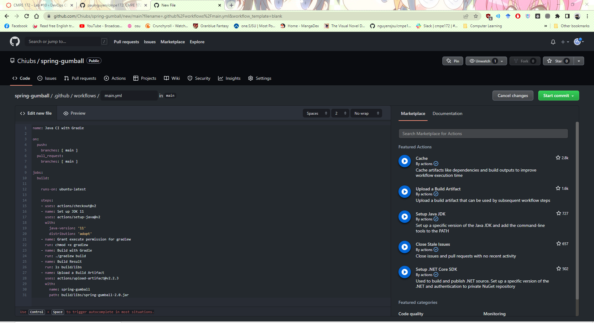
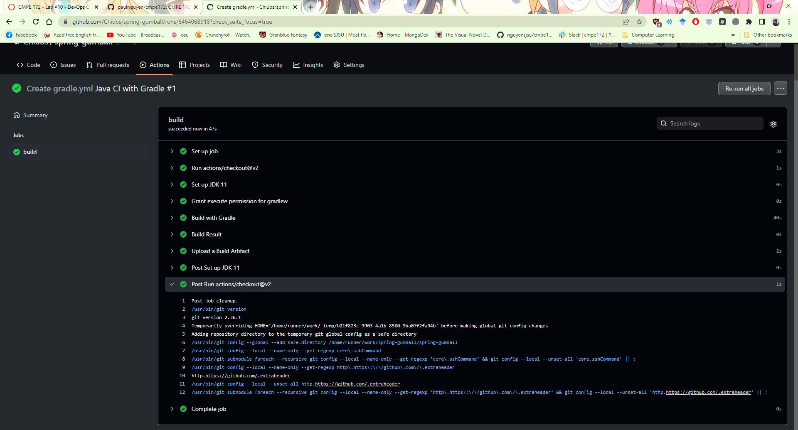
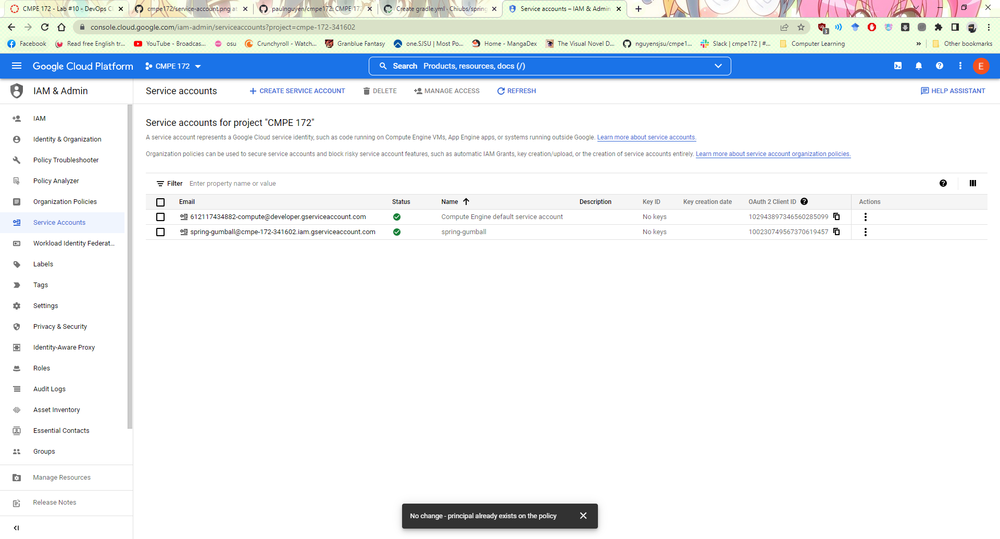
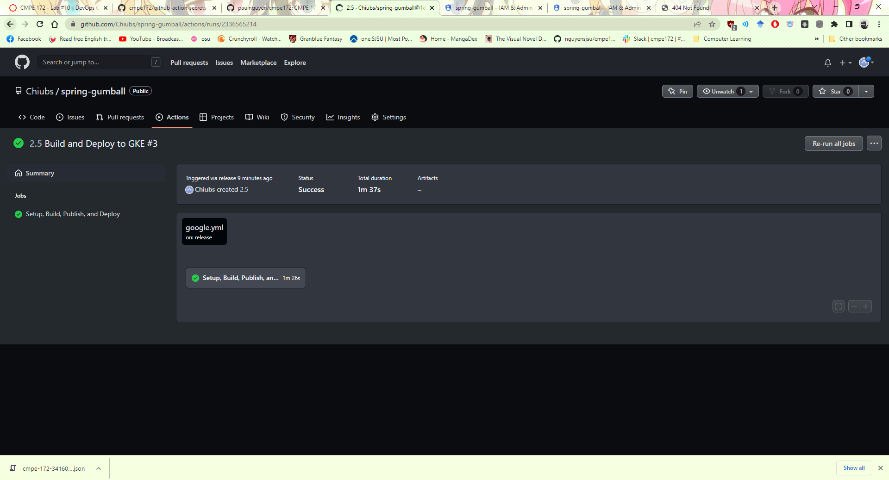
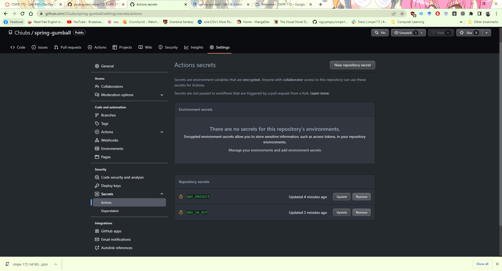
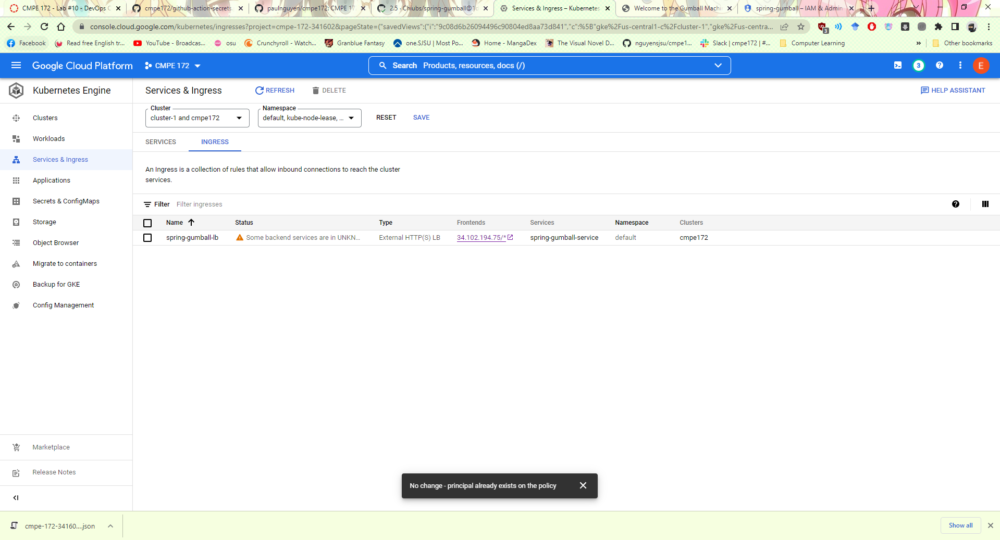
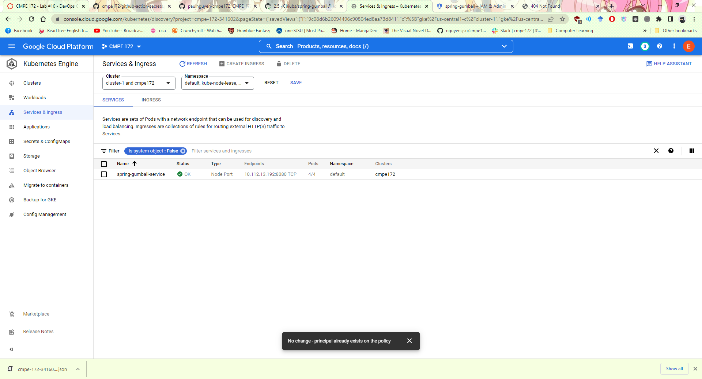
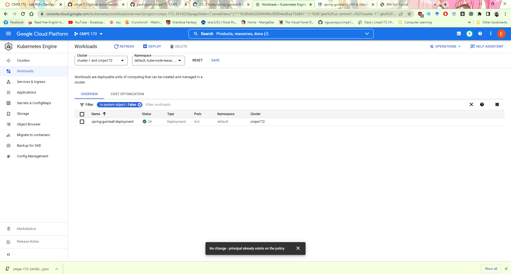
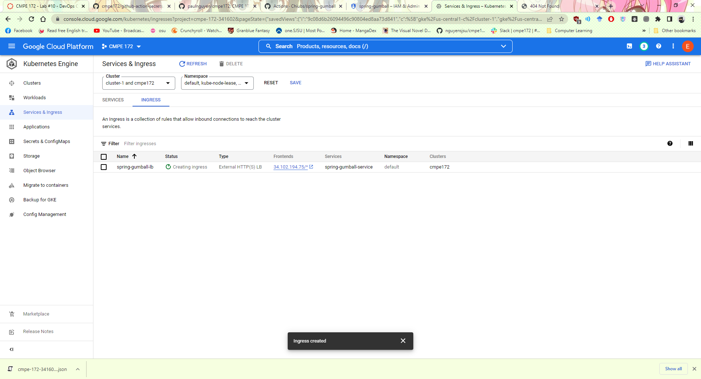
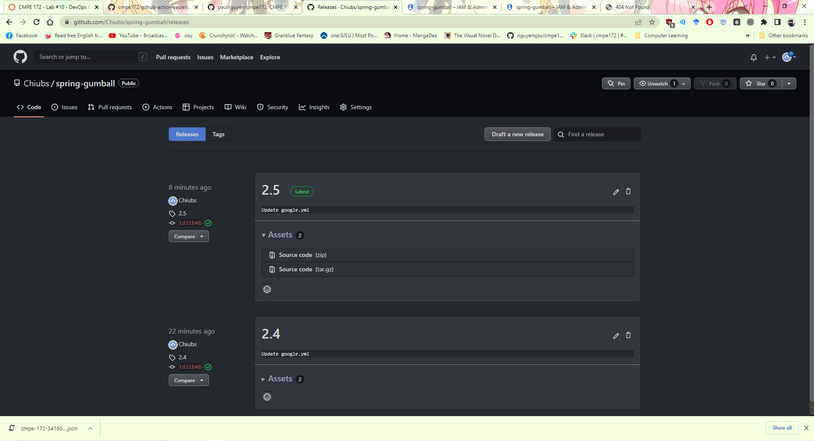
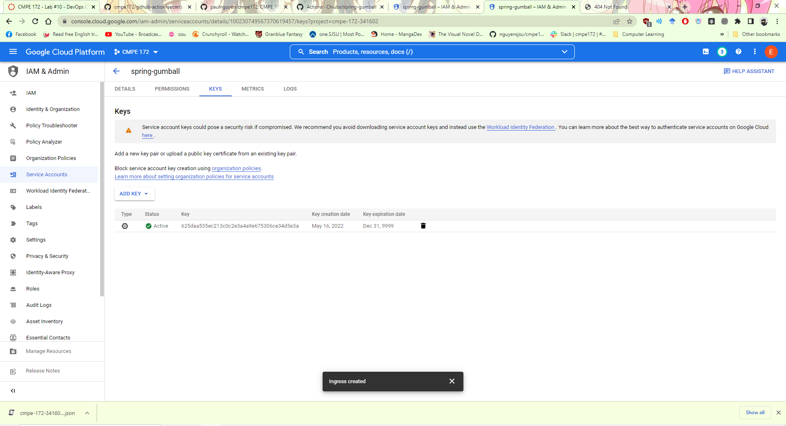
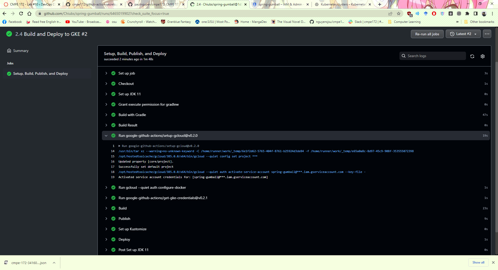
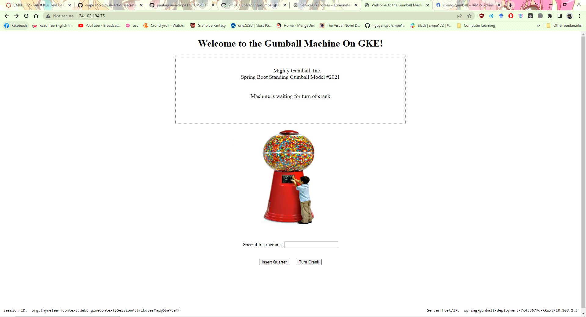
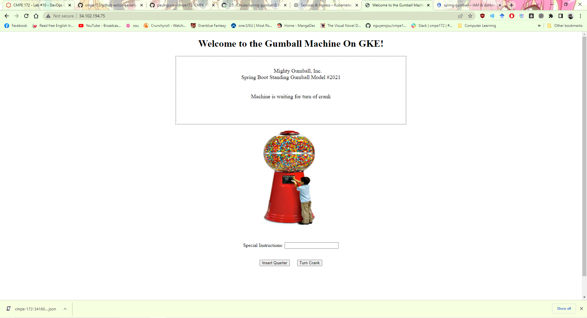

### There were a few issues I had ran into while trying to run this. The first issue was with the deployment of the first CI actions. I had nested another spring-gumball folder inside the gumball folder as I usually do to separate the images from the src folders, however, that made the actions not work and not be able to locate the workflows folder. My first initial thought was to change the workflow folder location when i initially created the action to out the workflow location into the nested folder, however, that also did now work. I had to eventually move all the necessary files out of the nested folder for it to actually work. The second issue I had was when I created the deployment action, but did not change the deployment variables. It was not run even when I released it. Instead of recreating the action, my fix was to manually change the google.yml file itself and then release a new version 2.4 -> 2.5 and this made it work. Another issue I ran into was that the action was not running and building, but that was because I had named the cluster I created as "cluster-1" rather than "cmpe172". Recreating the cluster and rerunning all jobs in the action tabs made this work. The final issue I had was with the load balancer not working 100%. I am unsure if this was on my end or the GKE's end. I was not able to make this work fully. I was able to connect to the website and insert a quarter ONCE, but if I cranked it, it would lead to a white error. I am not sure why it was not functional and it may have to do with the code that was provided.

